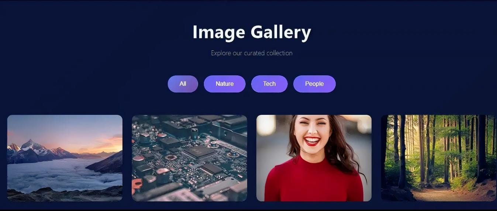

# 🚀 Hafiz Muhammad Ahmed | Frontend Developer Portfolio

Welcome to my professional portfolio! I am a _Frontend Developer_ who transforms ideas into stunning, high-performance web applications.

---

## 🛠️ Technical Arsenal

- _Languages:_ HTML5, CSS3, JavaScript (ES6+)
- _Expertise:_ DOM Manipulation, API Integration, Responsive UI

---

## 🌟 Featured Projects

## 1. 🖼️ Image Gallery

A visually stunning and responsive image gallery featuring smooth hover effects, lightbox viewing, and seamless grid layout.

- 🔗 _Live Link:_ [https://code-alpha-image-gallery-delta.vercel.app/]
- 💻 _GitHub Repo:_ [https://github.com/hmahmd/CodeAlpha_ImageGallery]

---

### 2. ⛅ Weather Dashboard

Real-time weather application with 7-day forecast using REST API integration.

- 🔗 _Live Link:_ [https://skycast-weather-app-khaki.vercel.app/]
- 💻 _GitHub Repo:_ [https://github.com/hmahmd/skycast-weather-app]

---

### 3. 🔢 Advanced Calculator

A feature-rich scientific calculator with history tracking and responsive design.

- 🔗 _Live Link:_ [https://modern-calculator-chi.vercel.app/]
- 💻 _GitHub Repo:_ [https://github.com/hmahmd/modern-calculator]

---

## 📱 Let's Connect

- _LinkedIn:_ [Click to visit my Profile](https://www.linkedin.com/in/hmahmd/)
- _GitHub:_ [Click to see my Repos](https://github.com/hmahmd/)
- _WhatsApp:_ [Message me on WhatsApp](https://wa.me/923112015969)

---

© 2026 Hafiz Muhammad Ahmed | Crafted with Passion

